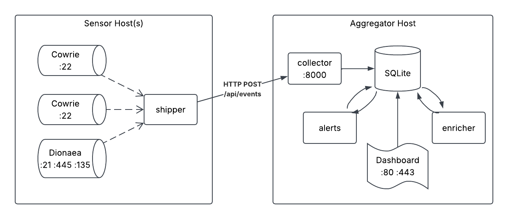

# TIADH — Distributed Honeypot Threat Intelligence Aggregator

Honeypot sensors on separate hosts ship what attackers do to a central
collector. One shared database holds it; rules turn it into alerts, enrichment
adds geolocation and scoring, a dashboard makes it readable, and an exporter
publishes it as a threat feed in JSON, CSV and STIX 2.1.

Two kinds of sensor answer different questions. **Cowrie** is an SSH shell: it
records what an attacker typed once they were in. **dionaea** impersonates
Windows network services — SMB above all — and records what they sent, up to and
including the malware they tried to plant. Both speak the same envelope, so the
collector, the rules and the dashboard cannot tell which produced a row except
by its `protocol`.

Everything speaks one contract: **Baseline v1.3**, defined in
`common/src/common/db/schema.sql` and enforced by `common/db/validation.py`.

---

## How it runs

Two commands on the aggregator host. One for the pipeline, one for the
dashboard.



**The sensors are the only thing that belongs on other machines.** Everything
else runs on one host, because the processes share a SQLite file and SQLite
needs local disk. The nodes never touch the database; they only speak HTTP to
the collector.

### The processes

| Process | Host | Command (from) | Port |
|---|---|---|---|
| **Cowrie honeypot** | sensor | `docker compose up -d` (`nodes/cowrie/`) | 2222 |
| **dionaea honeypot** | sensor | `docker compose up -d` (`nodes/dionaea/`) | 21, 445 |
| **Node adapter** | sensor | `uv run adapter.py` (in that node's directory) | — |
| **Aggregator** | aggregator | `uv run main.py serve` (`core/`) — or `docker compose up -d` | 8000 |
| **Dashboard** | aggregator | `uv run main.py` (`dashboard/`) — or `docker compose up -d` | 8050 |

- **adapter.py** tails its honeypot's JSON log across rotation, maps events onto
  the Baseline v1.3 envelope, and POSTs them in batches with `X-Node-ID` /
  `X-Node-Key` headers. Heartbeat every 60s; failed batches spool to
  `pending_events.jsonl` and retry every 30s. Only the mapping differs between
  the two sensors — the rest is `nodes/shipper/`, which both import.
- **main.py serve** runs three loops in one process:
  - *collector* — authenticates the node, validates the envelope, stores the
    batch. Also runs housekeeping every 60s (stale nodes offline, abandoned
    sessions closed).
  - *enricher* — every 30s, geolocates each new attacker IP (ip-api.com), scores
    it against AbuseIPDB, computes a local profile score from that IP's own
    session and command history, and upserts a `reputation` row. The AbuseIPDB
    half is skipped when no key is configured.
  - *alerts + feed export* — re-evaluates the seven detection rules over a
    rolling window, writes deduplicated alerts, rewrites the feed files.
- **dashboard** opens the database **read-only**. Acknowledging or closing an
  alert is its only write, and `DASHBOARD_ALLOW_ALERT_ACTIONS=0` removes that.

The alert engine is a mode of the core CLI, not a service: `main.py alerts` runs
one evaluation pass, `main.py run` one full cycle (housekeeping → alerts → feed
export), and `serve` that cycle on a timer.

---

## Quick start

### Just the dashboard, with generated data

No sensors, no collector — the fastest way to see every screen populated:

```bash
cd dashboard
uv run tools/seed_demo.py            # a day of realistic traffic
uv run main.py --db demo/honeypot_demo.db
```

Then open <http://127.0.0.1:8050>. The alerts on screen were produced by the
real rules engine running over the generated events, not written directly.

The Map screen draws attacker origins from the enriched coordinates, but the
sensor end is configuration — the `nodes` table has no latitude or longitude —
so give the generated nodes somewhere to be if you want the strike arcs:

```bash
DASHBOARD_NODE_COORDS="node-01:24.7136,46.6753; node-02:52.3676,4.9041; node-03:1.3521,103.8198" \
  uv run main.py --db demo/honeypot_demo.db
```

### The full pipeline

**1. Start the aggregator** — collector, enricher and alert/export cycle, one
process:

```bash
cp .env.example .env                        # from the repository root
cp .env.secrets.example .env.secrets        # then set real node keys
cd core
uv run main.py serve
```

It creates the schema on first start, so there is no separate init step. Ctrl-C
stops all three loops.

**2. Start the dashboard** in a second terminal. It reads the same `.env` and
therefore the same database — no second configuration step:

```bash
cd dashboard
uv run main.py
```

**3. On each sensor host**, run a honeypot and its adapter. The two node
directories work the same way — pick whichever that host is running:

```bash
cd nodes/cowrie                             # or nodes/dionaea
cp .env.example .env                        # set COLLECTOR_URL and NODE_KEY
docker compose up -d                        # Cowrie on :2222, dionaea on :21 and :445
uv run adapter.py                           # reads the .env beside it
```

Confirm the loop closed: `ssh -p 2222 root@<sensor>` for Cowrie, or an FTP login
attempt against `<sensor>:21` for dionaea, then watch the session appear on the
dashboard's Sessions screen.

A dionaea sensor publishes a port per service it can report — fourteen of them,
including 80, which is the one likely to collide with something already on that
host. See `nodes/dionaea/README.md`.

### Running the pieces separately

`serve` is a convenience, not a lock-in. Every loop is still its own entry
point, which is what you want when working on one of them:

```bash
cd core && uv run uvicorn --app-dir collector app.main:app --reload
cd core && uv run enricher/enrich.py
cd core && uv run main.py watch --interval 30
```

`watch` is `serve` without the collector and the enricher — it does run the
housekeeping sweep, because in that shape nothing else is.

### In Docker

Both halves are containerised, each with its own compose file. They share no
network — only the `tiadh_db` volume, because the dashboard reads the database
directly rather than calling the collector:

```bash
docker volume create tiadh_db      # once — the shared database volume

docker compose -f core/docker-compose.yml      up -d --build   # aggregator, on :8000
docker compose -f dashboard/docker-compose.yml up -d --build   # dashboard, on 127.0.0.1:8050
```

Order does not matter. `serve` creates the schema, and until it has, the
dashboard shows its setup screen rather than an empty page.

A dashboard container that does not mount that **same named volume** is not
looking at the collected data — that mount is the whole integration.

Inside a container `DASHBOARD_HOST` is `0.0.0.0` and the port is published as
`127.0.0.1:8050`, so the loopback decision lives in compose's `ports:`. To reach
the dashboard from the lab network, drop the `127.0.0.1` prefix there and set
`DASHBOARD_SECRET_KEY` first — it signs the session carrying the CSRF token for
the alert actions. Either port moves without a rebuild:

```bash
DASHBOARD_PORT=9050 docker compose up -d
```

`.env` and `.env.secrets` are excluded from the build context, so a container is
configured by compose's `environment:` block or by a secrets manager — not by a
file baked into the image.

### Published images

`.github/workflows/publish-images.yml` pushes both images to GHCR on every
commit to `main`, so a deployment host needs no checkout and no build:

```
ghcr.io/kaust-is-better-than-u-think/tiadh-core
ghcr.io/kaust-is-better-than-u-think/tiadh-dashboard
```

Each is tagged `latest`, which follows `main`, and `sha-<full commit>`, which
never moves — pin a deployment to the SHA. While the repository is private,
pulling needs a login with `read:packages`:

```bash
echo "$GITHUB_TOKEN" | docker login ghcr.io -u <username> --password-stdin
docker pull ghcr.io/kaust-is-better-than-u-think/tiadh-dashboard:latest
```

The compose files build from source. To run a published image instead, add an
`image:` line to the service and drop `--build`.

---

## Configuration

One pair of files per host. On the aggregator:

```bash
cp .env.example .env                  # everything: paths, thresholds, dashboard
cp .env.secrets.example .env.secrets  # node keys + the dashboard signing key
```

That is the whole setup step. `common/config.py` loads both on import, so the
collector, the enricher, the alert cycle **and** the dashboard pick them up with
nothing exported and nothing sourced. Both files are gitignored and excluded
from Docker build contexts; the `.example` templates are committed.

**A real environment variable always beats the file**, which is what keeps
per-run overrides, `--db`, and Docker's `environment:` block working:

```bash
FEED_MIN_SEVERITY=high uv run main.py serve     # wins over .env
```

The files are parsed as data, not sourced by the shell, so values with spaces
(`FEED_PRODUCER`) and JSON braces (`NODE_KEYS_JSON`) need no quoting — quote
only a value containing ` #`. Set `TIADH_ENV_FILE` to point somewhere else, or
to the empty string to ignore the files entirely.

The settings you will actually touch:

| Variable | Default | |
|---|---|---|
| `HONEYPOT_DB_PATH` | inside the installed `common` package | **Every part on the host must resolve to the same file.** Leave it unset unless you need to move it — and if you set it, make it **absolute**, or each process resolves it against its own working directory. |
| `HONEYPOT_EXPORT_DIR` | `common/src/common/exports` | Where the published feed files are written |
| `KNOWN_NODES` | `node-01,node-02,node-03` | Node IDs allowed to submit events |
| `COLLECTOR_HOST` / `COLLECTOR_PORT` | `0.0.0.0` / `8000` | Where the collector listens. `0.0.0.0` because the sensors are remote — the opposite of the dashboard. Change the port here **and** in every sensor's `COLLECTOR_URL`. |
| `NODE_KEYS_JSON` | *(secrets file)* | Collector's `node-id` → secret key map |
| `DASHBOARD_SECRET_KEY` | *(secrets file)* | Set before exposing the dashboard off loopback |
| `ALERT_WINDOW_MINUTES` | `5` | How far back each rule looks per pass |
| `FEED_MIN_SEVERITY` | `medium` | Severity floor for the published feed |

`.env.example` lists every setting with comments; `common/config.py`,
`core/collector/app/config.py` and `dashboard/app/settings.py` are the three
modules that read them. Detection thresholds live in `common/config.py` and the
dashboard's rules panel reads them live, so what you see there is what the
engine is using.

`serve` takes flags for the runtime knobs:

| Flag | Default | |
|---|---|---|
| `--host` / `--port` | `COLLECTOR_HOST` / `COLLECTOR_PORT` | Collector bind address, for one run |
| `--interval` | `30` | Seconds between alert/export cycles |
| `--enrich-interval` | `30` | Seconds between enrichment passes |
| `--no-enricher` | off | Skip the enricher — it calls ip-api.com and AbuseIPDB, so use this offline |
| `--window`, `--min-severity` | from `common/config.py` | Per-run overrides |

### Sensor hosts

A sensor is a different machine with no `common` package, so it configures
itself: copy that node's `.env.example` to `.env` and `adapter.py` loads it from
its own directory, never by searching upwards.

Three values have to agree with the aggregator: `NODE_ID` must appear in
`KNOWN_NODES`, `NODE_KEY` must match that node's entry in `NODE_KEYS_JSON`, and
`COLLECTOR_URL` must name the address the collector is actually bound to — with
the aggregator's routable IP in place of a `0.0.0.0` bind.

---

## Layout

```
.env.example          aggregator-host configuration — copy to .env
.env.secrets.example  node keys + dashboard signing key — copy to .env.secrets
.github/workflows/    publish-images.yml — both images to GHCR on every main commit
common/     the shared library — installed, imported by everything
  config.py            .env loading, all thresholds and paths
  db/                  Database, schema.sql, Baseline v1.3 validation
  alerting/            detection rules + the alert engine
  export/              threat feed builder (JSON / CSV / STIX 2.1)
core/       the aggregator — one uv project, one process in deployment
  main.py              CLI: serve, init, seed, ingest, alerts, export, run,
                       watch, stats, validate
  collector/           FastAPI ingest service
  enricher/            geolocation + scoring worker
  Dockerfile           builds the whole aggregator; CMD is `main.py serve`
dashboard/  Flask read model over the database
  Dockerfile           the same read model behind waitress; mounts tiadh_db
nodes/      sensor deployment
  shipper/             the sensor half that is not about the honeypot: tail a
                       log across rotation, batch, heartbeat, spool, retry
  cowrie/              docker-compose + Cowrie's event mapping   (SSH)
  dionaea/             docker-compose + dionaea's event mapping  (FTP, SMB)
                       each its own uv project — no `common`, they run on
                       other hosts, and both depend on ../shipper by path
```

`common` is the only package the others depend on, and it depends on nothing
outside the standard library. Nothing imports `core` — not the dashboard, not
the collector.

## Tests

```bash
cd core && uv run pytest          # collector: HTTP, auth, dedupe, contract
```

---

## Known rough edges

- **The adapter's default log path is relative.** `LOG_PATH` defaults to
  `./cowrie-logs/cowrie.json` (and the dionaea equivalent), which is where
  `docker-compose.yml` mounts the logs — but it resolves against the working
  directory, so an adapter started from anywhere else finds nothing. Set an
  absolute path.
- **`NODE_ID` defaults to a real node ID rather than an error** — `node-02` for
  the Cowrie sensor, `node-03` for the dionaea one — so a sensor started without
  one silently claims to be that node. Two sensors of the same kind on one
  network will both claim it unless each `.env` says otherwise.
- **The abuse score needs a key to exist at all.** With no `ABUSEIPDB_API_KEY`
  set, the enricher leaves `abuse_score` NULL — geolocation and the local
  profile score still work, and `high_risk_ip` fires on the profile score alone.
  The enricher says so in its log at startup.
- **ip-api.com rate-limits to 45 requests a minute** on the free tier, AbuseIPDB
  to 1000 checks a day, so a burst of new attacker IPs will start failing
  lookups. A failed lookup is written as NULL rather than zero — but it is still
  written, on a fresh `last_updated`, so that IP is not retried for 7 days.
  Clear its `reputation` row to retry sooner.
- **One collector test fails.** `test_rejects_bad_command_contract` expects a
  malformed event to return HTTP 200 with `rejected: 1`, but `app/models.py`
  validates the `details` contract in the HTTP layer and returns 422. The test
  and the code disagree about where validation belongs.
- **Node health is wall-clock based**, so a seeded demo database drifts to amber
  and then red as real time passes. Re-run the seeder before a demo.
